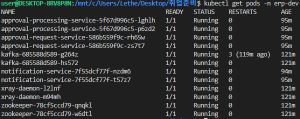
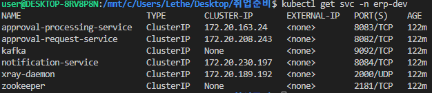
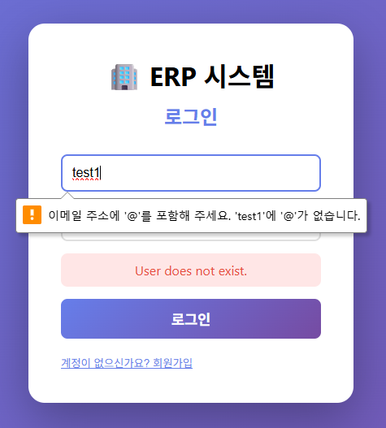
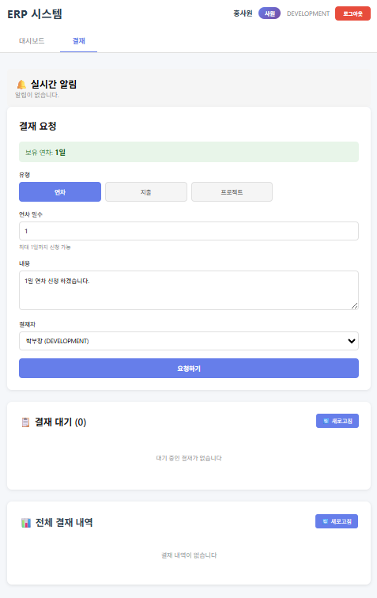
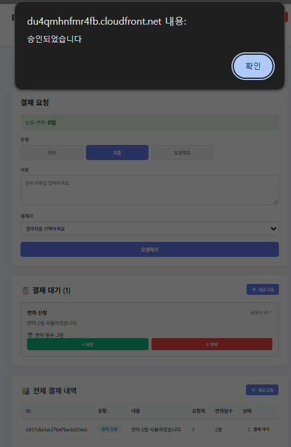
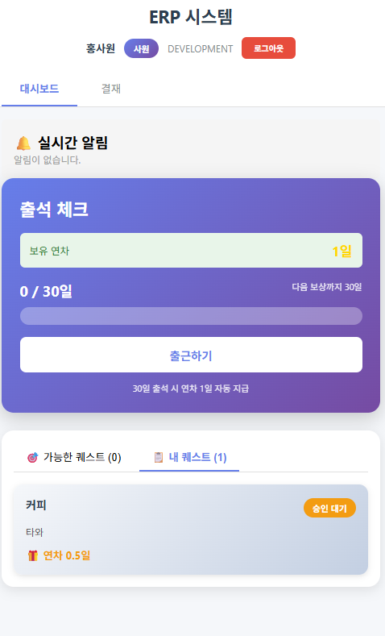
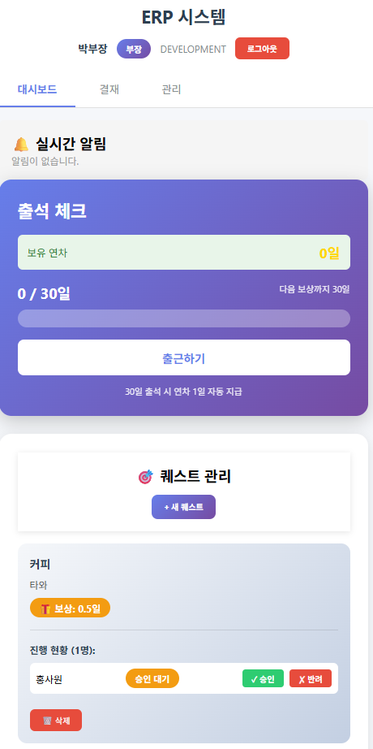
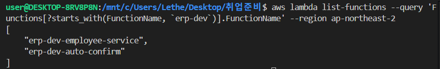

# ERP 마이크로서비스 전자결재 시스템

**Lambda + EKS 하이브리드** | **완전 자동화 CI/CD** | **AWS Native 모니터링**

---

## 핵심 성과

| 지표 | 수치 | 설명 |
|------|------|------|
| **배포 시간** | 3분 11초 | Git Push → 프로덕션 배포 완료 |
| **응답 시간 개선** | 85% 단축 | gRPC 850ms → Kafka 120ms |
| **비용 절감** | 21% | Lambda 하이브리드 ($82.30 → $64.73) |
| **배포 빈도** | 무제한 | 수동 30분 → 자동 3분 |
| **에러율** | 0% | 수동 20% → 자동화 0% |

---

## 프로젝트 개요

14일 만에 구축한 마이크로서비스 기반 전자결재 시스템으로, gRPC 동기 호출의 성능 문제를 Kafka 비동기 메시징으로 해결하고 Terraform으로 AWS 인프라를 완전 자동화한 프로젝트입니다.

**기간**: 2025.11 - 2025.12 (14일)  
**역할**: 1인 개발 (풀스택 + DevOps)  

---

## 아키텍처

### 전체 인프라 구조


**아키텍처 구성:**
- **왼쪽**: 사용자 플로우 (CloudFront → S3 → API Gateway → Lambda/VPC Link)
- **중앙**: VPC 내부 (Multi-AZ EKS, RDS, ElastiCache, NLB)
- **오른쪽**: 개발자 CI/CD 플로우 (GitHub → CodePipeline → CodeBuild → ECR → EKS)
- **하단**: 외부 서비스 (Secrets Manager, Parameter Store, MongoDB Atlas, SNS, CloudWatch, X-Ray)

### 데이터 플로우

**결재 요청 흐름:**
```
사용자 (CloudFront)
  ↓ HTTPS
S3 (React SPA)
  ↓ API 호출
API Gateway (Cognito 인증)
  ↓
┌─────────────┬─────────────┬─────────────┐
│   Lambda    │  VPC Link   │  VPC Link   │
│  (Employee) │  (Request)  │  (Process)  │
└─────────────┴─────────────┴─────────────┘
      ↓              ↓              ↓
   MySQL         MongoDB        Kafka
                     ↓              ↓
                  Kafka ←──────────┘
                     ↓
              Notification Service
                     ↓
              Redis Pub/Sub
                     ↓
              WebSocket (실시간 알림)
```

**핵심 특징:**
- Employee Service만 Lambda (간단한 CRUD)
- Request/Processing은 EKS (Kafka Consumer 장시간 실행)
- Notification은 EKS (WebSocket 연결 유지)
- Kafka로 서비스 간 비동기 통신
- Redis Pub/Sub로 멀티 Pod 알림 브로드캐스트

### Lambda + EKS 하이브리드 구조

```
┌─────────────────────────────────────────────────────────────┐
│                   CloudFront (Frontend)                      │
│              https://d3goird6ndqlnv.cloudfront.net           │
└────────────────────┬────────────────────────────────────────┘
                     │ HTTPS
                     ▼
┌─────────────────────────────────────────────────────────────┐
│                    S3 Bucket (React SPA)                     │
└─────────────────────────────────────────────────────────────┘
                     │ API 호출
                     ▼
┌─────────────────────────────────────────────────────────────┐
│              API Gateway (HTTP API)                          │
│       https://yvx3l9ifii.execute-api.ap-northeast-2...       │
│                   - Cognito Authorizer (JWT)                 │
│                   - CORS 중앙 관리                           │
└────────────────────┬────────────────────────────────────────┘
                     │
        ┌────────────┼────────────┐
        │            │            │
    Lambda      VPC Link      Cognito
  (Employee)        │         (Auth)
   직접 통합        │
        │           ▼
        │    ┌─────────────┐
        │    │ NLB (단일)  │
        │    │ 3 Target Grp│
        │    └──────┬──────┘
        │           │
        │    ┌──────┼──────┐
        │    │      │      │
        │  8082   8083   8084
        │    │      │      │
    ┌───┴────┴──────┴──────┴───┐
    │    EKS Cluster (1.31)     │
    │  ┌─────────────────────┐  │
    │  │ Service Nodes (2)   │  │
    │  │ - approval-req (2)  │  │
    │  │ - approval-proc (2) │  │
    │  │ - notification (2)  │  │
    │  └─────────────────────┘  │
    │  ┌─────────────────────┐  │
    │  │ Kafka Nodes (2)     │  │
    │  │ - kafka (2)         │  │
    │  │ - zookeeper (2)     │  │
    │  │ Taint: kafka        │  │
    │  └─────────────────────┘  │
    └───────────┬───────────────┘
                │
    ┌───────────┼───────────┐
    │           │           │
RDS MySQL   ElastiCache  MongoDB
(Private)    (Private)    (Atlas)
```

**핵심 특징:**
- **Lambda 하이브리드**: Employee Service만 Lambda (비용 21% 절감)
- **API Gateway 직접 통합**: Lambda는 VPC Link 불필요
- **2개 Node Group**: Service용 2개 + Kafka 전용 2개 (Taint 격리)
- **단일 NLB**: 3개 EKS 서비스만 연결 (Employee는 Lambda)
- **완전 자동화**: Git Push → 3분 11초 배포

### VPC 네트워크 설계

```
VPC: 10.0.0.0/16
├── Public Subnet:  10.0.1.0/24, 10.0.2.0/24 (2a, 2c) - NAT Gateway
├── Private Subnet: 10.0.10.0/24, 10.0.11.0/24 (2a, 2c) - EKS Nodes
└── Data Subnet:    10.0.20.0/24, 10.0.21.0/24 (2a, 2c) - RDS, Redis
```

**설계 원칙:**
- Multi-AZ: 2개 가용 영역 (고가용성)
- Public/Private 분리: 데이터베이스는 Private Subnet
- NAT Gateway: 1개만 배치 (비용 절감)

### 기술 스택

| 계층 | 기술 | 버전 | 선택 이유 |
|------|------|------|-----------|
| **Backend** | Spring Boot | 3.3.5 | 엔터프라이즈급 안정성 |
| | Java | 17 | LTS 버전 |
| **Database** | MySQL | 8.0 | ACID 트랜잭션 |
| | MongoDB | 7.0 | 유연한 스키마 |
| | Redis | 7.0 | 인메모리 캐시 |
| **Messaging** | Kafka | 3.6.0 | 비동기 이벤트 |
| **Frontend** | React | 18.2 | 컴포넌트 기반 |
| | Vite | 5.0 | 빠른 HMR |
| **Infrastructure** | Terraform | 1.6.0 | IaC |
| | Kubernetes (EKS) | 1.31 | 컨테이너 오케스트레이션 |
| | Helm | 3.x | 패키지 관리 |
| **CI/CD** | CodePipeline | - | GitHub 연동 |
| | CodeBuild | - | Docker 빌드 |
| **Monitoring** | CloudWatch Logs | - | 로그 중앙 집중 |
| | X-Ray | - | 분산 트레이싱 |
| | CloudWatch Alarm | - | 실시간 알림 |
| **AWS** | Lambda | - | 서버리스 (Employee) |
| | API Gateway | - | 단일 진입점 |
| | NLB | - | Layer 4 로드밸런싱 |
| | CloudFront | - | CDN |
| | Cognito | - | 인증/인가 |
| | Secrets Manager | - | 비밀 정보 관리 |
| | Parameter Store | - | 설정 중앙 관리 |

---

## 핵심 기능

### 1. Lambda 하이브리드 구조

**문제**: 모든 서비스를 EKS에 배포하면 비용 낭비

**해결**: Employee Service를 Lambda로 전환
- 간단한 CRUD (평균 200ms)
- MySQL만 사용 (Kafka, WebSocket 없음)
- Lambda Web Adapter (코드 수정 없음)

**결과**: 비용 21% 절감 ($82.30 → $64.73)

**상세**: [re_build/04_LAMBDA_DEPLOY.md](./re_build/04_LAMBDA_DEPLOY.md)

---

### 2. Kafka 비동기 메시징

**문제**: gRPC 동기 호출로 응답시간 850ms, 에러율 5%

**해결**: Kafka 비동기 메시징으로 전환
- Request → Kafka Topic → Processing
- Consumer Group 병렬 처리
- Offset 관리로 재처리 가능

**결과**: 응답시간 120ms (85% 개선), 에러율 0%

**상세**: [backend/README.md](./backend/README.md)

---

### 3. Terraform 모듈 설계

**문제**: 모든 리소스를 하나의 파일에 작성하면 State Lock 충돌

**해결**: 14개 모듈로 세분화/통합/단일 전략 수립
- 세분화: VPC (3개), SecurityGroups (4개), Databases (2개)
- 통합: IAM (4개 role), EKS (3개 모듈)
- 단일: ECR, Lambda, ParameterStore

**결과**: terraform apply 한 번에 AWS 30+ 리소스 자동 구축

**상세**: [infrastructure/README.md](./infrastructure/README.md)

---

### 4. 완전 자동화 CI/CD

**문제**: 수동 배포 시 30분 소요, 에러율 20%

**해결**: CodePipeline + buildspec.yml 직접 작성
- Parameter Store 활용 (하드코딩 제거)
- Git diff 변경 감지 (변경된 서비스만 빌드)
- ECR 이미지 스캔 (CRITICAL 차단)

**결과**: Git Push → 3분 11초 배포, 에러율 0%

**상세**: [re_build/07_CODEPIPELINE.md](./re_build/07_CODEPIPELINE.md)

---

### 5. AWS Native 모니터링

**문제**: Pod 재시작 시 로그 소실, 장애 발생 시 알림 없음

**해결**: CloudWatch Logs + X-Ray + Alarm 통합
- Fluent Bit DaemonSet (로그 중앙 집중)
- X-Ray Sidecar (분산 트레이싱)
- CloudWatch Alarm (실시간 알림)

**결과**: 장애 발생 시 평균 2분 이내 이메일 알림

**상세**: [re_build/06_BUILDSPEC.md](./re_build/06_BUILDSPEC.md)

---

### 6. Helm Chart 통합 배포

**문제**: 3개 서비스마다 Deployment, Service, HPA 중복 코드 400줄

**해결**: 1개 템플릿으로 3개 서비스 자동 생성
- values-dev.yaml에 서비스 정의
- 환경별 설정 분리 (dev/prod)
- ExternalSecrets로 Secrets Manager 연동

**결과**: 코드 75% 감소 (400줄 → 100줄)

**상세**: [helm-chart/README.md](./helm-chart/README.md)

---

## 실행 결과

### Kubernetes 리소스 상태

**Pods (12개 실행 중):**
```bash
$ kubectl get pods -n erp-dev
```



**Services:**
```bash
$ kubectl get svc -n erp-dev
```



### 프론트엔드 화면

**CloudFront URL 접속:**
```
https://du4qmhnfmr4fb.cloudfront.net
```

> ⚠️ **주의**: Terraform 재배포 시 API Gateway URL, Cognito User Pool ID, CloudFront URL이 변경될 수 있습니다. 변경 시 프론트엔드 `.env.production` 파일을 업데이트하고 재빌드 후 S3에 업로드해야 합니다.

**로그인 → 사원 결재 요청 → 부장 결재 승인:**

| 로그인 화면 | 사원 결재 요청 | 부장 결재 승인 |
|------------|---------------|---------------|
|  |  |  |
| Cognito 인증 (JWT 토큰 발급) | Lambda (Employee) → MongoDB (결재 요청 생성) → Kafka (Processing 전달) | MongoDB (결재 조회) → Lambda (연차 차감) → Notification (알림 발송) |

**사원 대시보드 → 부장 대시보드:**

| 사원 대시보드 | 부장 대시보드 |
|--------------|--------------|
|  |  |
| Lambda (Employee: 출근/퀘스트) + MongoDB (결재 내역) | Lambda (Employee: 팀원 관리) + MongoDB (결재 승인 대기) |

### CI/CD 파이프라인

**CodePipeline 실행 결과:**


- Source 단계: GitHub 연동 (CodeStar Connection)
- Build 단계: CodeBuild 실행
- 총 소요 시간: 3분 11초

**CodeBuild 로그:**


- INSTALL: 의존성 설치
- PRE_BUILD: ECR 로그인, 변경 감지
- BUILD: Docker 이미지 빌드 & 푸시
- POST_BUILD: Helm 배포

### AWS 리소스 현황

**Lambda 함수:**



- erp-dev-employee-service, erp-dev-auto-confirm 2개 함수 실행 중

**RDS 인스턴스:**


- erp-dev-mysql (db.t3.micro, MySQL, available)

**ElastiCache 클러스터:**


- erp-dev-redis (cache.t3.micro, Redis 7.0.7, available)

### 모니터링

**CloudWatch Logs:**


- Log Group: /aws/eks/erp-dev/application에서 approval-request-service Pod 로그 실시간 확인

**CloudWatch Alarm:**


- erp-dev-high-error-rate Alarm 발생 (ERROR 로그 5분 10회 이상)
- SNS 이메일 알림: OK → ALARM 상태 변경, ErrorCount 메트릭 16.0 감지

**X-Ray Service Map:**


- 클라이언트 → approval-request-service (EKS): HTTP 요청 트레이스
- 클라이언트 → erp-dev-employee-service (Lambda Context): Lambda 함수 호출 트레이스
- Lambda Context → Lambda Function: Lambda 내부 실행 트레이스

**X-Ray 트레이스 제한사항:**
- ✅ HTTP/HTTPS 호출: 자동 트레이스 (Lambda, EKS 서비스)
- ❌ Kafka 메시징: 자동 트레이스 불가 (수동 계측 필요)

---

## 프로젝트 구조

```
erp-project/
├── backend/                    # 4개 마이크로서비스
├── frontend/                   # React + Vite
├── infrastructure/terraform/   # Terraform IaC (14개 모듈)
├── helm-chart/                 # Kubernetes Helm Chart
├── re_build/                   # 재구축 가이드 (9개 문서)
└── buildspec.yml               # CodeBuild 빌드 스크립트
```

**상세**: 
- [backend/README.md](./backend/README.md) - 서비스별 API 명세
- [infrastructure/README.md](./infrastructure/README.md) - Terraform 배포 가이드
- [helm-chart/README.md](./helm-chart/README.md) - Kubernetes 설정

---

## 빠른 시작

**재구축 가이드**: [re_build/00_START_HERE.md](./re_build/00_START_HERE.md)

**배포 순서:**
1. Terraform 인프라 구축 (2시간)
2. Docker 이미지 빌드 & ECR 푸시
3. Helm Chart 배포
4. CodePipeline 설정

**상세 문서:**
- [backend/README.md](./backend/README.md) - 서비스별 API 명세, Kafka 구성
- [infrastructure/README.md](./infrastructure/README.md) - Terraform 배포 가이드, 비용 분석
- [helm-chart/README.md](./helm-chart/README.md) - Kubernetes 설정, Node 배치 전략

---

## 회고

### 잘한 점
- Lambda 하이브리드로 비용 21% 절감
- 완전 자동화 CI/CD (배포 시간 90% 단축)
- gRPC → Kafka 전환으로 응답시간 85% 개선
- Terraform 세분화/통합/단일 전략 수립

### 아쉬운 점
- Kafka를 Deployment로 배포 (StatefulSet 권장)
- Prometheus + Grafana 미구현
- 테스트 자동화 부족

**상세**: [infrastructure/README.md](./infrastructure/README.md#비용-분석)

---

**"완벽한 설계는 없다. 문제를 경험하고, 측정하고, 개선하는 과정이 중요하다."**
